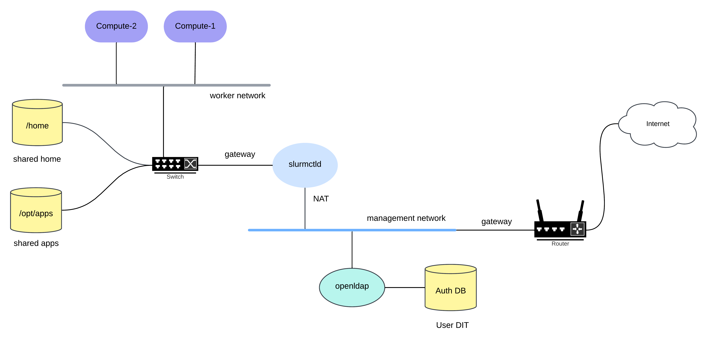

<p align="left">
  
</p>

# Docker HPC Cluster
The Docker HPC Cluster project, developed by the Center for Research Computing at The University of Alabama at Tuscaloosa, offers a straightforward method for setting up a prototype distributed HPC. Utilizing Docker Compose, this repository configures a distributed HPC environment featuring a three-node system, a shared filesystem, and an [openLDAP](https://www.openldap.org/) server for centralized authentication. It is intended for HPC software development, testing and experimentation. Moreover, this setup is ideal for educational settings, enabling students from diverse backgrounds to explore HPC system operations, learn about job scheduling, and manage distributed systems in a controlled environment. The cluster is designed to be scalable, allowing users to add more compute nodes, storage, and services as needed.


## Installation and Usage
Setting up the cluster is simple. First, make sure Docker Engine and Docker Compose are installed on your system. If they are not, you can refer to Docker's official installation guide [here](https://docs.docker.com/get-docker/). Once Docker Engine and Docker Compose are installed, clone this repository and run the following command to initiate the HPC cluster:
```bash
docker compose up -d
```

This command will start the HPC cluster in the background. You can check the status of the cluster by running the following command.

```bash
docker compose ps
```
This should show you the status of the containers running in the cluster.The running containers should show you the following output. Some additional columns may be there, but these are the main columns that you should see:
```bash
NAME                        IMAGE                            SERVICE             CREATED             STATUS                
dockercluster-compute-1-1   node:ubuntu-v24.10               compute-1           7 minutes ago       Up 7 minutes (healthy)   
dockercluster-compute-2-1   node:ubuntu-v24.10               compute-2           7 minutes ago       Up 7 minutes (healthy)   
dockercluster-openldap-1    bitnami/openldap:2.5-debian-12   openldap            7 minutes ago       Up 7 minutes (healthy)   
dockercluster-slurmctld-1   node:ubuntu-v24.10               slurmctld           7 minutes ago       Up 7 minutes (healthy)   
```
**Note: On the initial run, it may take a few minutes to set up the daemons since SLURM is compiled and installed in a NFS fashion. You can check the container status to monitor their health. The containers are considered healthy once all daemons are up and running. Please be patient and refrain from submitting jobs until all health checks have passed.**

If you want to see the logs of the containers mainly daemons logs, you can run the following command. 
```bash
docker compose logs -f
```

If you want to stop the cluster, you can run the following command.

```bash
docker compose down
```
This will stop the cluster and remove the containers. However, the volumes and networks will still be there for data persistence  for another run.
If you want to remove the containers, volumes, and networks, you can run the following command.
```bash
docker compose down -v  --rmi all
```
**Note: This will remove all the containers, volumes, and networks i.e all the persistent data will be lost. Do not use -v if you want to keep the volumes.**

## Cluster Topology and Networks
The diagram below illustrates the cluster topology, including the networks and the shared filesystem.
<p align="center">
  
  <br/>
  <span style="display: block; font-size: 1.1em; margin-top: 5px;">Figure 1: Cluster Topology and Networks</span>
</p>

The purple nodes represent the compute nodes, the cyan node indicates the LDAP server, and the light blue node shows the SLURM controller. The cluster operates on two distinct networks: the management network and the compute network. The home directory, apps directory, and optionally, Auth DB data are stored in the persistant filesystem provided by the Docker volume. The worker network is isolated from the internet, with outgoing traffic routed through the head node, where it is NATed to the internet. This setup creates a single entry point to the cluster and enables traffic monitoring. The topology is reflected in the [docker-compose.yml](docker-compose.yml) file, which defines the services, networks, and volumes used in the cluster.

## Daemons and Shared Filesystem
The `slurmctld` daemon, running within the `slurmctld` container, manages the compute nodes, schedules jobs, and monitors the cluster. Meanwhile, the `slurmd` daemon, operating on the compute nodes, is responsible for executing jobs. The shared filesystem, which includes the home and apps directories, is mounted across all compute nodes. This setup ensures that any software installed in the apps directory, along with its dependencies, is available on all compute nodes, utilizing the same shared libraries. For this to function correctly, the software must be built against the same OS and architecture, which is valid in this case, as all nodes run the same OS and architecture.

## The LDAP Authentication Server
To run SLURM, a uniform UID and GID must be maintained across all nodes. This is accomplished using an LDAP server, which provides centralized authentication. The LDAP server is configured using the settings in the [ldap.env](/environments/ldap.env) file before the container is started. It is not recommended to modify the LDAP configuration. If changes are necessary, you must also update the sssd [config](/configurations/sssd.conf) file, startup [scripts](/scripts/), and [env_files](/environments/) to reflect the adjustments propelry. The LDAP server is initialized with the entries specified in the [bootstrap](/data/bootstrap.ldif) ldif file, and [sssd](https://sssd.io/) is used to manage authentication.


## Job Submission
The cluster is configured to accept job submissions from the head (slurmctld) node. To submit a job, you must first log in to the head node. Use the user account in the 'bootstrap.ldif' file to log in  or use the slurm admin account defined in [slurm.env]('/environments/slurm.env'). To log in, use the following command after the containers are healthy and running.
```bash
docker compose exec slurmctld login <username>
```
After logging in, you can submit a job to the scheduler. Here is the command to submit a job.
```bash
srun -N2  python3 -c "import socket; print(f'hello world from {socket.gethostname()}')"
```
This command will submit a job to the scheduler to run on two nodes. The job will print the hostname of the nodes where it is running. Note the order of the nodes may vary. The output will look like this:
```bash
hello world from compute-1
hello world from compute-2
```

## Scripts and Configuration Files
The entrypoint scripts and configuration files are stored in the [scripts](/scripts) and [configurations](/configurations) directories, respectively. The scripts handle the configuration of the LDAP server, setup of the shared filesystem, installation of SLURM, and synchronized startup of the daemons. Written in Python, the scripts are easy to read and modify. Developers can adjust these scripts to observe their effects, enhance functionality, or troubleshoot the system. The configuration files are utilized by the scripts to set up the services. Developers can edit these files to alter the behavior of the services.


## Use Cases and Applications
In a homogeneous cluster, software can be built using the same OS and architecture within this container, then mounted on the real cluster for seamless use. While Singularity may offer a better option, this approach is also effective. Additionally, containers can be built using Singularity, and since root access to the containers is available, one can install the necessary software and dependencies, test the container in an MPI environment, and then deploy it to the real cluster. Furthermore, new applications can be developed, installed, and tested before being deployed on the real cluster, allowing for user feedback prior to final implementation.


## Acknowledgements
This was developed at the Center for Research Computing at The University of Alabama (UA) by the HPC research computing team for UA's educational and research purposes. 

## Maintainers
This project is maintained by the following individuals:
- [Center for Research Computing](https://www.hpc.ua.edu/)
- [Nischal Bhattarai](mailto:nischalbhattaraipi@gmail.com)


## License
This project is licensed under the MIT License - see the [LICENSE](LICENSE) file for details.